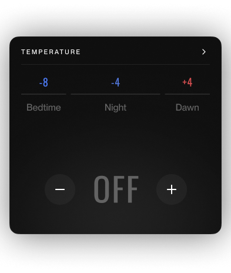
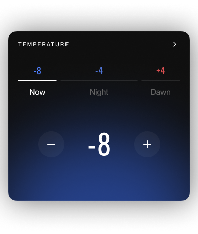
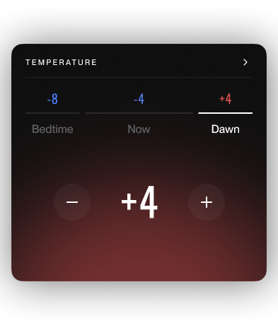

## The Temperature Card
There are 3 temperature phases in one night's sleep session: Bedtime, Night, and Dawn.  
The temperature card shows the user's preset temperatures for each phase at the top of the card, with the current phase's temperature shown in the center of the card.  

## UX: 
1) Pressing a temperature phase will update the currently selected phase and reflect the phase's temperature in the center of the card.
2) Tapping the "OFF" turns the temperature on, and tapping the current temperature value shows a bottomsheet that asks for confirmation to turn off temp. 
3) Pressing the +/- buttons will adjust the currently selected phase temperature. The +/- buttons should be disabled while the temperature is in an OFF state.
4) The temperature setting has 4 states: On, idle, cooling, warming.  
5) The temperature values range from -10 to +10, including 0, which represents a neutral state (not off)
6) Ignore the "Now" labels under the phases in the images (the phases should always be named "Bedtime", "Night", and "Dawn"
7) Draw the > Chevron at the top of the card, but it's not necessary to add any click handling for it.

## Figma File
* https://www.figma.com/design/eCymjharIRGffdUPgfKS5d/Tempereature-card
* Password is: 8Sleep

## Task:
1) Given the UX specifications above, build a temperature card based off of the reference images above.
2) Create a mock service that responds to user inputs, adding an artificial delay to simulate network latency 
3) Show your best work and your ability to think through the intentional ambiguity of the bare project.

Response data classes are provided, as well as some commonly used android libraries.  Feel free to import any libraries that you need.  Everything else is left open to your interpretation.

## Work and Submission Process:
1) Clone this repo into a PRIVATE repo under your account.
2) Grant access to your repo with @vincewkao @mzdon and @cal-8s.
3) As you work, commit incremental changes that show your work and thought process.
4) Email your recruiter to let them know when your submission is ready for review.
